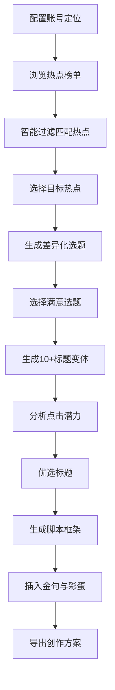

## 1. 产品概述
面向内容创作者的智能选题工具，帮助创作者快速发现热点、生成差异化选题、优化标题、搭建脚本框架，一站式解决内容创作的前期痛点。
- 核心目标：降低内容创作者的选题门槛，提升内容质量和爆款概率
- 目标用户：短视频博主、自媒体作者、公众号运营者、内容创业者

## 2. 核心功能

### 2.1 用户角色
| 角色 | 注册方式 | 核心权限 |
|------|----------|----------|
| 内容创作者 | 账号密码/模拟登录 | 使用所有选题功能，保存创作记录，配置账号定位 |

### 2.2 功能模块
1. **热点追踪页**：全网热点榜单、智能过滤、热点详情、关联推荐
2. **选题生成页**：用户定位配置、选题建议列表、差异化角度分析
3. **标题优化页**：标题变体生成、点击潜力评分、优化建议
4. **脚本框架页**：脚本结构生成、金句推荐、彩蛋位置规划

### 2.3 页面详情
| 页面名称 | 模块名称 | 功能描述 |
|---------|----------|----------|
| 热点追踪页 | 热点榜单 | 实时展示全网热点，支持按平台分类（微博、抖音、知乎等），显示热度指数和趋势 |
| 热点追踪页 | 智能过滤 | 根据用户配置的账号定位（领域、受众、风格）自动过滤不相关热点，高亮高匹配度热点 |
| 热点追踪页 | 热点详情 | 点击热点查看详细信息，包括事件脉络、网友观点、相关话题 |
| 选题生成页 | 用户定位配置 | 设置账号领域（职场/美妆/科技等）、目标受众（00后/宝妈/程序员等）、内容风格（幽默/干货/情感等） |
| 选题生成页 | 选题建议列表 | 基于热点和用户定位生成差异化选题建议，包含选题角度、内容方向、切入点分析 |
| 选题生成页 | 选题详情 | 查看选题的受众分析、竞争程度、内容延伸方向 |
| 标题优化页 | 标题变体生成 | 为选定选题生成10+个标题变体，覆盖不同风格和角度 |
| 标题优化页 | 点击潜力分析 | 对每个标题进行多维度评分（好奇心指数、情感共鸣、实用价值、独特性），给出综合评分 |
| 标题优化页 | 标题对比 | 支持多个标题对比分析，可视化展示各维度得分 |
| 脚本框架页 | 脚本结构生成 | 自动生成开头引入、正文分论点、结尾升华的完整脚本框架 |
| 脚本框架页 | 金句推荐 | 基于选题内容推荐适配的金句，可插入脚本对应位置 |
| 脚本框架页 | 彩蛋规划 | 智能推荐彩蛋位置和类型（反转、互动、福利等），提升完播率 |

## 3. 核心流程
用户配置账号定位 → 浏览智能过滤后的热点榜单 → 选择感兴趣的热点 → 系统生成差异化选题建议 → 选择选题并生成多个标题变体 → 分析标题点击潜力并优选 → 自动生成完整脚本框架（含金句和彩蛋）→ 导出或保存创作方案

## 4. 用户界面设计

### 4.1 设计风格
- **主色调**：深紫蓝色 `#1E1B4B` 作为主背景，搭配渐变紫 `#8B5CF6` 作为强调色，营造专业、智能的科技感
- **辅助色**：金色 `#F59E0B` 用于高亮推荐，绿色 `#10B981` 表示高分，红色 `#EF4444` 表示低竞争力
- **按钮风格**：圆角胶囊按钮，带有微妙的悬浮动效和渐变背景
- **字体**：标题使用 `Noto Sans SC` 加粗，正文使用 `Inter` 保持可读性，数据展示使用等宽字体
- **布局风格**：卡片式布局，层次分明，使用玻璃拟态（Glassmorphism）效果增强现代感
- **图标风格**：线性图标搭配渐变填充，统一使用圆角风格

### 4.2 页面设计概述
| 页面名称 | 模块名称 | UI 元素 |
|---------|----------|---------|
| 热点追踪页 | 热点榜单 | 左侧分类导航，右侧热点卡片瀑布流，热度指示器（火焰图标+数值），匹配度标签，悬浮动效 |
| 选题生成页 | 选题建议列表 | 顶部用户定位配置面板，下方选题卡片网格，每个卡片显示选题标题、差异化标签、评分星级 |
| 标题优化页 | 标题变体列表 | 中心选题展示区，下方标题卡片网格，每个卡片显示评分雷达图微缩预览，点击展开详情 |
| 脚本框架页 | 脚本编辑器 | 左右分栏布局，左侧脚本结构树，右侧编辑区，金句和彩蛋以标签形式嵌入，拖拽调整顺序 |

### 4.3 响应式设计
- **桌面端优先**：充分利用大屏空间，采用多列布局展示丰富信息
- **平板适配**：自动调整为两列布局，侧边栏可折叠
- **移动端**：单列布局，底部导航切换，触控区域不小于 44px

### 4.4 动效设计
- 页面加载：元素渐入 + 轻微上浮，依次延迟营造层次感
- 卡片悬浮：背景轻微放大 + 阴影加深 + 边框发光
- 数据更新：热点数值变化时使用数字滚动动画
- 评分展示：雷达图使用描边动画逐步填充
- 状态切换：页面切换使用淡入淡出 + 滑动过渡
