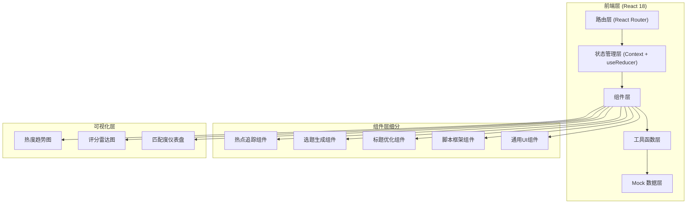
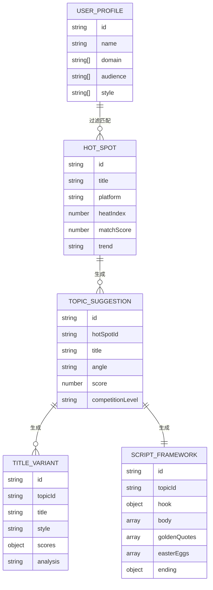

## 1. 架构设计


## 2. 技术描述
- **前端框架**: React@18.2.0 + TypeScript@5.3.0
- **构建工具**: Vite@5.0.0
- **样式方案**: TailwindCSS@3.4.0 + CSS Variables
- **路由管理**: React Router@6.20.0
- **图表库**: Recharts@2.10.0（热度趋势图、雷达图）
- **图标库**: Lucide React@0.294.0
- **动画库**: Framer Motion@10.16.0（交互动效）
- **状态管理**: React Context + useReducer（轻量级方案）
- **数据来源**: Mock 数据（模拟AI生成结果）
- **代码规范**: ESLint + Prettier

## 3. 路由定义
| 路由路径 | 页面名称 | 页面用途 |
|---------|----------|----------|
| `/` | 首页/热点追踪 | 展示全网热点榜单，智能过滤推荐 |
| `/topics` | 选题生成 | 基于热点生成差异化选题建议 |
| `/titles` | 标题优化 | 生成标题变体并分析点击潜力 |
| `/script` | 脚本框架 | 生成完整脚本框架，含金句和彩蛋 |
| `/profile` | 账号设置 | 配置用户定位、领域、受众等信息 |

## 4. 数据类型定义
```typescript
// 热点数据类型
interface HotSpot {
  id: string;
  title: string;
  platform: 'weibo' | 'douyin' | 'zhihu' | 'xiaohongshu' | 'bilibili';
  heatIndex: number;
  trend: 'rising' | 'stable' | 'falling';
  matchScore: number;
  category: string;
  description: string;
  timeline: Array<{ time: string; event: string }>;
  relatedTopics: string[];
  createdAt: string;
}

// 用户定位类型
interface UserProfile {
  id: string;
  name: string;
  domain: string[]; // 领域：职场、美妆、科技等
  audience: string[]; // 目标受众
  style: string[]; // 内容风格
  platform: string[]; // 发布平台
}

// 选题建议类型
interface TopicSuggestion {
  id: string;
  hotSpotId: string;
  title: string;
  angle: string; // 差异化角度
  description: string;
  audienceAnalysis: string;
  competitionLevel: 'low' | 'medium' | 'high';
  contentDirections: string[];
  score: number;
  tags: string[];
}

// 标题变体类型
interface TitleVariant {
  id: string;
  topicId: string;
  title: string;
  style: 'curiosity' | 'emotion' | 'practical' | 'controversy' | 'story';
  scores: {
    curiosity: number;
    emotion: number;
    practical: number;
    uniqueness: number;
    overall: number;
  };
  analysis: string;
  suggestions: string[];
}

// 脚本框架类型
interface ScriptFramework {
  id: string;
  topicId: string;
  title: string;
  hook: { // 开头引入
    type: string;
    content: string;
    duration: string;
  };
  body: Array<{ // 正文分论点
    id: string;
    title: string;
    content: string;
    duration: string;
    goldenQuote?: string;
  }>;
  goldenQuotes: Array<{ // 金句推荐
    id: string;
    content: string;
    position: string;
    type: string;
  }>;
  easterEggs: Array<{ // 彩蛋规划
    id: string;
    position: string;
    type: string;
    description: string;
  }>;
  ending: { // 结尾升华
    content: string;
    callToAction: string;
    duration: string;
  };
  totalDuration: string;
}
```

## 5. 模块目录结构
```
src/
├── components/          # 组件目录
│   ├── common/         # 通用组件（按钮、卡片、导航等）
│   ├── hotspot/        # 热点追踪模块组件
│   ├── topic/          # 选题生成模块组件
│   ├── title/          # 标题优化模块组件
│   ├── script/         # 脚本框架模块组件
│   └── charts/         # 图表组件
├── pages/              # 页面组件
├── context/            # 状态管理
├── data/               # Mock 数据
├── types/              # TypeScript 类型定义
├── utils/              # 工具函数
├── hooks/              # 自定义 Hooks
├── App.tsx
├── main.tsx
└── index.css
```

## 6. 核心数据模型
### 6.1 实体关系图


### 6.2 Mock 数据策略
- 预置 20+ 条模拟热点数据，覆盖多个平台和领域
- 预置选题生成算法，基于热点关键词和用户定位进行匹配
- 预置标题模板库，支持 5 种以上标题风格的变体生成
- 预置脚本结构模板，支持不同内容类型的框架生成
- 所有数据使用 TypeScript 类型安全约束
